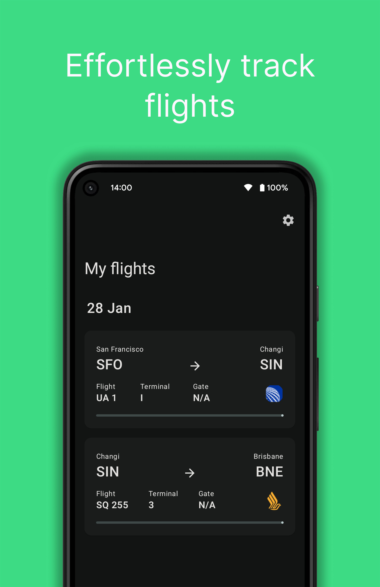
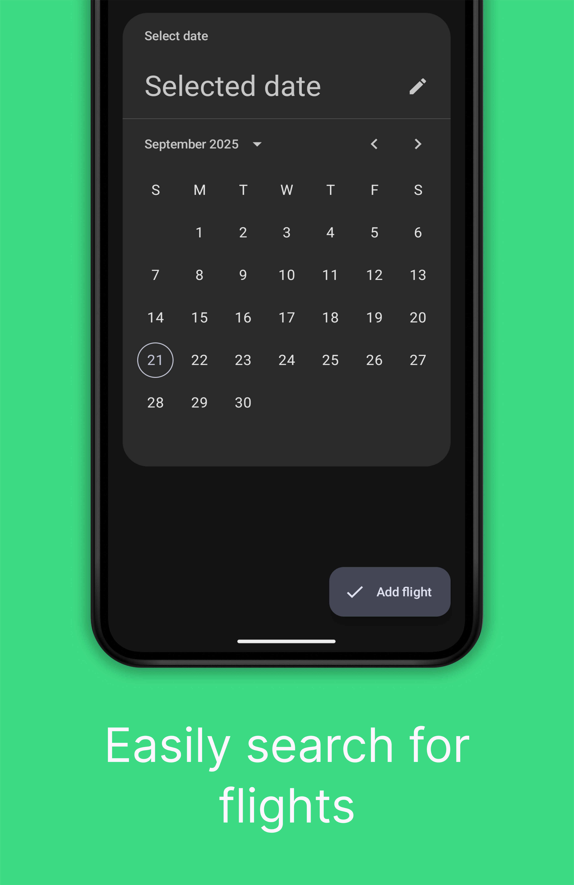

# Airo - A flight management application

## Screenshots

|  |  |  |  |  |
|---------------------------------------------|---------------------------------------------|---------------------------------------------|---------------------------------------------|---------------------------------------------|

**Now with public AiroAPI server at `https://airoapi.tuxy.stream/flights`!**

## Current features

- Adding, removing flights using [aerodatabox's](https://aerodatabox.com/)
  api [link](https://aerodatabox.com/)
    - Adding flights with schedules 8 months in advance
- Usage with AiroAPI caching server
- Automatic refreshing of flight data and flight updates
- Route map and progress
- Aircraft information with photos
- Flights organised by date
- Scanning boarding passes for information and boarding
- Notifications 6 hour before flight

## Contributing?

For anyone that would like to help with this mess of a codebase, you are completely welcome!
See [Contributing.md](/Contributing.md) for more information on how you can help.

## Libraries used/credits

*all code from libraries are to follow their respective project licenses*

- MapCompose https://github.com/p-lr/MapCompose
- USGS Topo map https://www.usgs.gov/ (December 2024)
    - MOBAC (MOBile Atlas Creator) https://mobac.sourceforge.io/
- ComposedBarcodes https://github.com/simonsickle/ComposedBarcodes
- Coil Image loading https://coil-kt.github.io/coil/
- Square libraries https://square.github.io/
    - OkHttp
- Zxing embedded https://github.com/journeyapps/zxing-android-embedded
- Klaxon JSON Parsing https://github.com/cbeust/klaxon
- Compose-html https://github.com/ireward/compose-html
- Radarbox logo's provided by Jxck-S https://github.com/Jxck-S/airline-logos
- PreferencesCompose for app preferences https://github.com/JamalMulla/ComposePrefs3
- RoomBackup for backup/restore
  functionality https://github.com/rafi0101/Android-Room-Database-Backup
