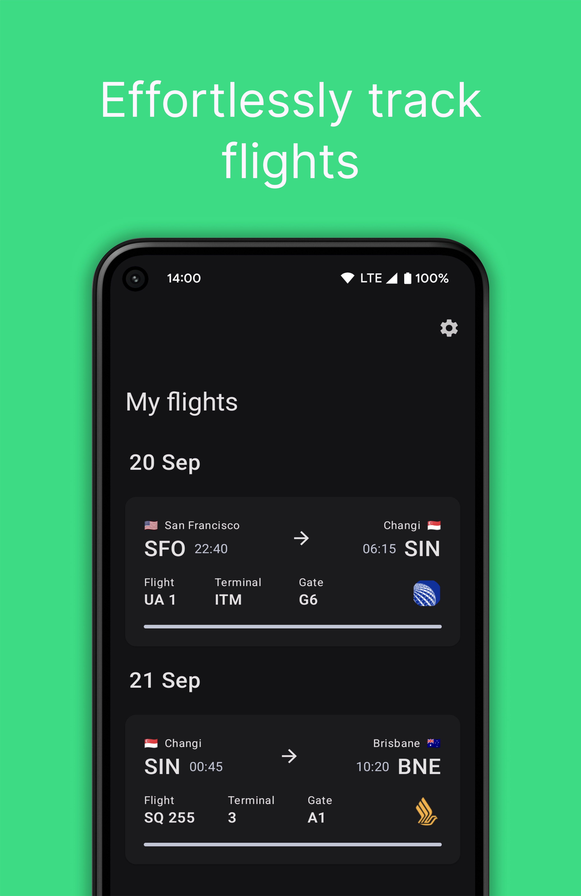

# Airo - A flight management application

## Screenshots
|  |  |  |  |  |
|---|---|---|---|---|

## Current features

- Adding, removing flights using [aerodatabox's](https://aerodatabox.com/) api (API KEY IS NEEDED)
    - Adding flights with schedules 8 months in advance
- Route map and progress
- Aircraft information with photos
- Flights organised by date

## TODO before release / Roadmap

- Functional progress indication for flight (DONE)
- Flights with date headers, for grouping transfers (DONE)
- Implement check-in and boarding timings for progress bar (DONE)
    - +Integration with notifications
- Periodic alerts and status for flights
- Regional Locale settings
- Bugfixes

